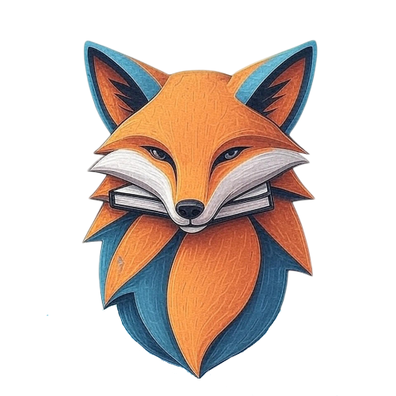

# FoxBat-EduHub Learning Platform 🚀

  

---

## Welcome to the Future of Learning! 🎓

Dive into the **FoxBat-EduHub Learning Platform**, an innovative online educational hub designed to make learning interactive, accessible, and rewarding. Inspired by the best of online learning experiences, we're building a space where knowledge meets practice, and skills are truly earned.

---

## What We're Building 💡

Our platform aims to revolutionize how you learn by providing:

* 📖 **Rich, Text-Based Courses:** Clear and comprehensive learning materials covering diverse subjects.
* 🕹️ **Interactive Practice Playgrounds:** Get hands-on with what you learn in our live coding and practice environments.
* 🧠 **Engaging Quizzes:** Test your understanding and reinforce key concepts with end-of-course assessments.
* 🏅 **Verifiable Certifications:** Earn uniquely authenticated certificates upon completion, showcasing your new skills.

---

## Join Our Journey! ✨

The FoxBat-EduHub Learning Platform is more than just a site; it's a community-driven initiative within the broader FoxBat-EduHub. We're passionate about fostering education and empowering learners. Stay tuned for updates, new courses, and exciting features!

---

## License

This project is open-source under the [MIT License](LICENSE).

---

## Acknowledgements

A huge shoutout to the vibrant FoxBat community and all contributors for their dedication to spreading knowledge!

---
